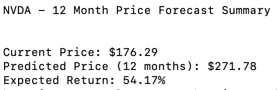
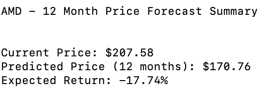
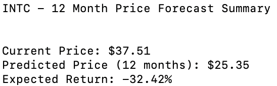
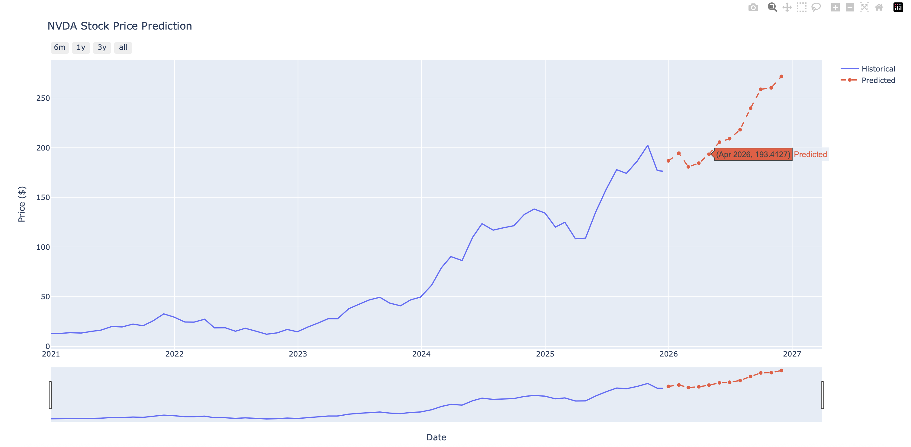
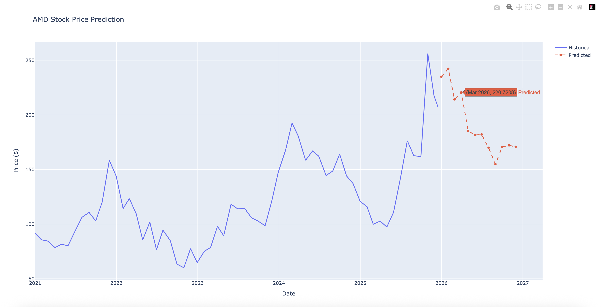
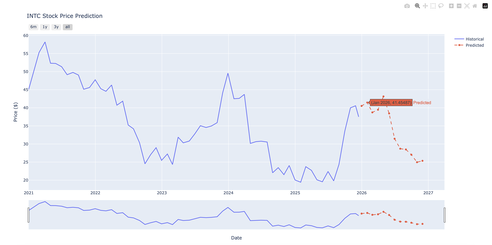

# stock-price-prediction
Python based stock price movement prediction solution using a simple Linear Auto Regressive machine learning model trained on past 5 years of monthly adjusted stock price data of NVDA, AMD and INTC. The model is used to predict the next 12 months of stock prices of the companies. Finally, an interactive dashboard is displayed for the respective companies.

# Stock Price Predictor


## Features

- Extracts 5 years of monthly adjusted stock data using the Alpha Vantage API
- Trains a Linear Auto Regressive model using PyTorch
- Generates 12 month price forecasts for each stock
- Displays an interactive visualization dashboard using Plotly
- Supports NVDA, AMD, and INTC stock symbols as of now

## Prerequisites

- Python 3.7 or higher
- Alpha Vantage API key, free tier can be requested from here: https://www.alphavantage.co/support/#api-key

## Setup Instructions

1. **Clone the repository**
   ```bash
   git clone https://github.com/hasnainrampurawala/stock-price-prediction
   cd stock-price-prediction
   ```

2. **Install required dependencies**
   ```bash
   pip install requests python-dotenv pandas numpy torch plotly
   ```

3. **Set up your API key**
   Create a .env file in the project root directory and add your Alpha Vantage API key to the .env file:
   ```
   ALPHAVANTAGE_API_KEY=your_api_key_here
   ```

## Run Instructions
   
1. **Run the data extraction script**
   ```
   python extract_data.py
   ```
    
2. **Run the stock price prediction script**
   ```
   python predict_stock_price.py
   ```

3. **Select the stock ticker when prompted** 
   ```
   Enter stock ticker (NVDA, AMD, INTC): NVDA
   ```
    

## Output

**Stock Prediction Summaries**











**Stock Interactive Dashboards**











